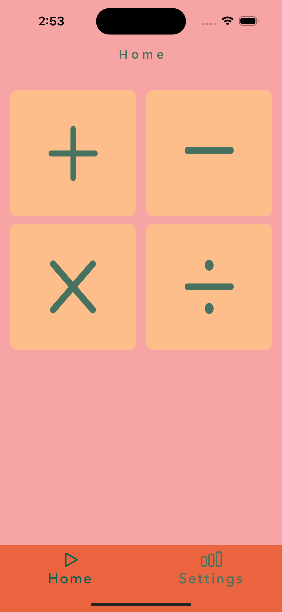
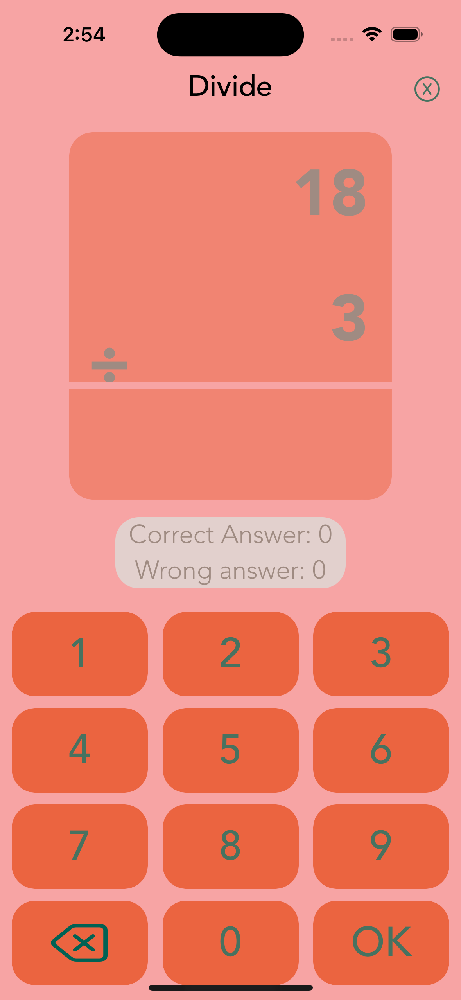
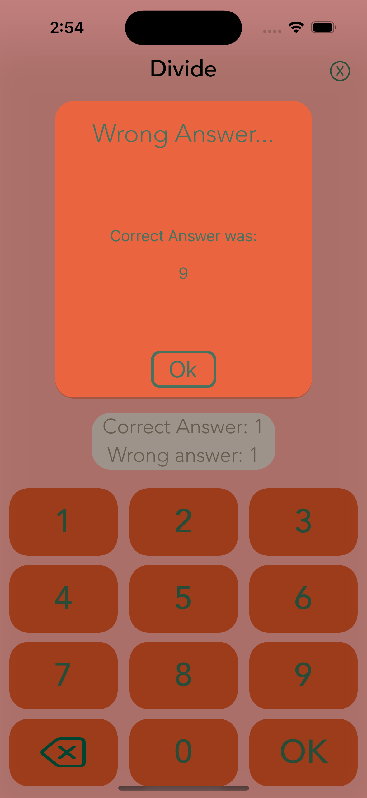
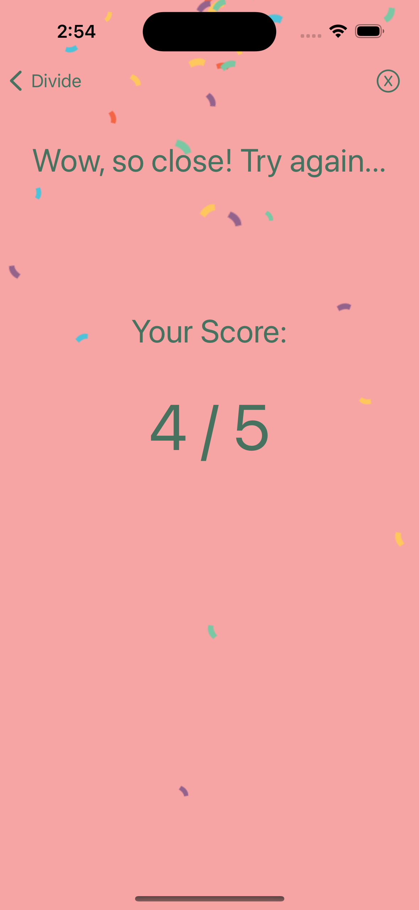
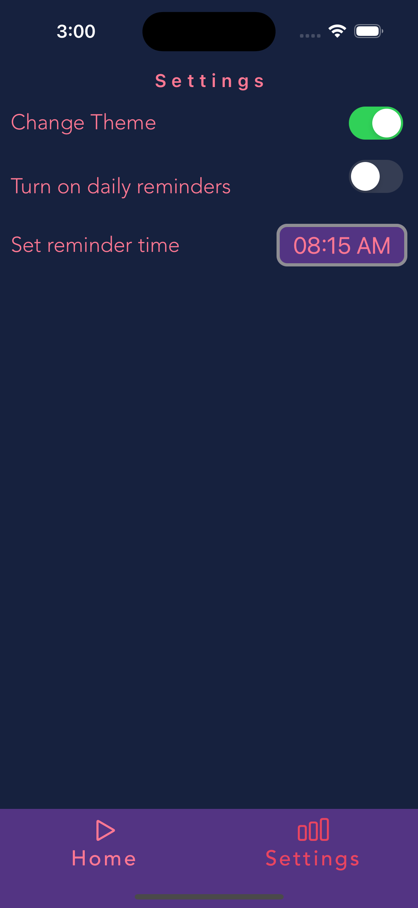

# Fun Math
Practice four operations (Addition, Subtraction, Multiplication, and Division)

## Features
* Utilized collection view and used as a keyboard
* Implemented delegate pattern
* Implemented local notifications for sending daily reminders to users.
* Implemented Cocoa Pod for Animation
* (Dark mode <=> Light Mode) switching functionality.
* Implemented UI programmatically by using Auto Layout to manage views across different iPhone
models.
* MVC Design pattern

## Technologies
* Swift 5
* UIKit
* User Notifications
* Delegate Pattern
* Core Data
* Cocoa Pods

   
   

              
 [LinkedIn](https://www.linkedin.com/in/mutluaydin/)
